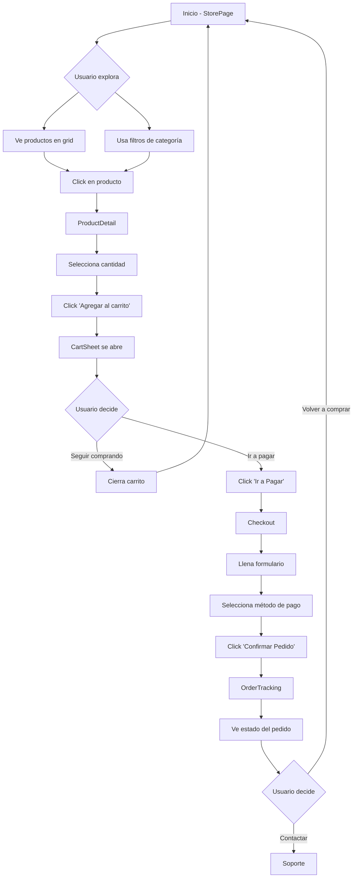

# Estructura de Temas - Documentación Completa

## 📋 Tabla de Contenidos
1. [Categorías de Temas](#categorías-de-temas)
2. [Estructura de un Tema](#estructura-de-un-tema)
3. [Mapeo de Datos del Backend](#mapeo-de-datos-del-backend)
4. [Vistas Obligatorias](#vistas-obligatorias)
5. [Componentes Requeridos](#componentes-requeridos)
6. [Atributos de Productos](#atributos-de-productos)
7. [Flujo de Usuario](#flujo-de-usuario)
8. [Guía de Consistencia Visual](#guía-de-consistencia-visual)

---

## 🎨 Categorías de Temas

Cada tema pertenece a una categoría específica que define su estilo y productos:

| Categoría | Descripción | Productos Típicos | Ejemplo |
|-----------|-------------|-------------------|---------|
| **Tecnología** | Diseño moderno, limpio, tech-forward | Laptops, smartphones, gadgets, accesorios tech | Modern |
| **Moda** | Elegante, sofisticado, visual | Ropa, zapatos, accesorios, carteras | Elegante |
| **Hogar** | Cálido, acogedor, espacioso | Muebles, decoración, textiles, iluminación | Interior, Minimal |
| **Belleza** | Delicado, refinado, estético | Cosméticos, skincare, fragancias, maquillaje | Classic |
| **Deportes** | Dinámico, energético, bold | Ropa deportiva, equipamiento, suplementos | DarkMode |
| **Arte** | Creativo, expresivo, único | Arte, craft, diseño, productos artesanales | Creative |

---

## 🗄️ Mapeo de Datos del Backend

### Entidad Store (Backend)

Todos los temas DEBEN usar los datos que vienen del backend. Aquí está el mapeo completo:

```typescript
// StoreEntity del backend
interface StoreEntity {
  // === CAMPOS BÁSICOS ===
  name: string                  // Nombre de la tienda
  slug: string                  // URL slug (único)
  description?: string          // Descripción general

  // === BRANDING ===
  logoUrl?: string             // Logo de la tienda (usar en header)
  bannerUrl?: string           // Banner/imagen de fondo (usar en hero si aplica)
  faviconUrl?: string          // Favicon (solo si necesario)

  // === CONTENIDO DE SECCIONES ===
  aboutUs?: string             // Texto para sección "Acerca de Nosotros"
  heroTitle?: string           // Título principal del hero section

  // === INFORMACIÓN DE CONTACTO ===
  phone?: string               // Teléfono de contacto
  email?: string               // Email de contacto
  address?: string             // Dirección física
  city?: string                // Ciudad

  // === REDES SOCIALES ===
  facebookUrl?: string         // URL de Facebook
  instagramUrl?: string        // URL de Instagram
  whatsappNumber?: string      // Número de WhatsApp

  // === FEATURES/BENEFICIOS ===
  features?: {                 // Beneficios/características de la tienda
    icon: string               // Nombre del icono (ej: "Zap", "Shield", "Truck")
    title: string              // Título del beneficio
    description: string        // Descripción corta
  }[]

  // === CONFIGURACIÓN ===
  category?: string            // Categoría: tecnologia, moda, hogar, belleza, deportes, arte
  themeId?: string            // ID del tema a usar
  currency?: string           // Moneda: COP, USD, etc.
  isActive: boolean           // Si la tienda está activa
}
```

### Cómo Usar Estos Datos en los Temas

#### 1. **Header**
```tsx
<header>
  {/* Logo */}
  {store.logoUrl ? (
    <Image src={store.logoUrl} alt={store.name} />
  ) : (
    <div>{store.name.charAt(0)}</div>
  )}

  {/* Nombre de la tienda */}
  <h1>{store.name}</h1>

  {/* Navegación */}
  <nav>
    <Link href="#inicio">Inicio</Link>
    <Link href="#productos">Productos</Link>
    <Link href="#about">Nosotros</Link>
    <Link href="#contact">Contacto</Link>
  </nav>
</header>
```

#### 2. **Hero Section**
```tsx
<section className="hero">
  {/* Si hay banner, usarlo de fondo */}
  {store.bannerUrl && (
    <div className="hero-background">
      <Image src={store.bannerUrl} />
    </div>
  )}

  {/* Título personalizado o por defecto */}
  <h1>
    {store.heroTitle || `Bienvenido a ${store.name}`}
  </h1>

  <p>{store.description}</p>
</section>
```

#### 3. **Features Section**
```tsx
<section className="features">
  {/* Si tiene features personalizadas, usarlas */}
  {store.features && store.features.length > 0 ? (
    store.features.map((feature, i) => (
      <div key={i}>
        <FeatureIcon name={feature.icon} />
        <h3>{feature.title}</h3>
        <p>{feature.description}</p>
      </div>
    ))
  ) : (
    /* Features por defecto del tema */
    defaultFeatures.map(...)
  )}
</section>
```

#### 4. **About Us Section**
```tsx
<section id="about">
  <h2>Acerca de Nosotros</h2>

  {/* Usar el texto del backend */}
  <p>{store.aboutUs ||
    `En ${store.name}, nos dedicamos a ofrecer productos de la más alta calidad...`
  }</p>

  {/* Opcional: logo o imagen */}
  {store.logoUrl && <Image src={store.logoUrl} />}
</section>
```

#### 5. **Contact Footer**
```tsx
<footer id="contact">
  <h2>Contacto</h2>

  {/* Información de contacto */}
  <div className="contact-info">
    {store.email && (
      <div>
        <span>Email:</span>
        <a href={`mailto:${store.email}`}>{store.email}</a>
      </div>
    )}

    {store.phone && (
      <div>
        <span>Teléfono:</span>
        <a href={`tel:${store.phone}`}>{store.phone}</a>
      </div>
    )}

    {store.address && (
      <div>
        <span>Dirección:</span>
        <p>{store.address}{store.city && `, ${store.city}`}</p>
      </div>
    )}
  </div>

  {/* Redes sociales */}
  <div className="social-links">
    {store.facebookUrl && (
      <a href={store.facebookUrl} target="_blank">
        <FacebookIcon />
      </a>
    )}

    {store.instagramUrl && (
      <a href={store.instagramUrl} target="_blank">
        <InstagramIcon />
      </a>
    )}

    {store.whatsappNumber && (
      <a href={`https://wa.me/${store.whatsappNumber}`} target="_blank">
        <WhatsAppIcon />
      </a>
    )}
  </div>

  {/* Copyright */}
  <p>© {new Date().getFullYear()} {store.name}. Todos los derechos reservados.</p>
</footer>
```

### Reglas Importantes

1. **SIEMPRE verificar si el campo existe antes de usarlo** (usar `&&` o `||`)
2. **Proporcionar valores por defecto** cuando el campo no esté presente
3. **No inventar datos**: Si no viene del backend, usar texto genérico
4. **Respetar la estructura del backend**: Usar los nombres de campos exactos
5. **Features**: Si `store.features` existe, usarlo; si no, usar features por defecto del tema

---

## 🏗️ Estructura de un Tema

### Archivos Requeridos

Cada tema debe tener los siguientes archivos:

```
components/themes/[categoria]/[nombre-tema]/
├── index.ts                          # Barrel export
├── [Tema]StorePage.tsx              # Vista principal (HOME)
├── [Tema]StoreHeader.tsx            # Header con navegación
├── [Tema]ProductCard.tsx            # Tarjeta de producto
├── [Tema]ProductGrid.tsx            # Grid de productos
├── [Tema]ProductDetail.tsx          # Detalle de producto
├── [Tema]Checkout.tsx               # Proceso de pago
├── [Tema]OrderTracking.tsx          # Seguimiento de pedido
└── [Tema]CartSheet.tsx              # Carrito lateral
```

### Configuración del Tema

```typescript
// lib/themes/[nombre-tema].ts
export const [NOMBRE]_THEME: ProfessionalTheme = {
  id: 'nombre-tema',
  name: 'Nombre Tema',
  description: 'Descripción breve del tema',
  category: 'categoria',

  generateColors: (customColors: CustomColors) => ({
    // Colores base
    background: '#FFFFFF',
    surface: '#F9FAFB',
    border: '#E5E7EB',
    borderLight: '#F3F4F6',

    // Colores primarios
    primary: customColors.primary || '#...',
    primaryHover: '#...',
    primaryLight: '#...',
    primaryDark: '#...',

    // Colores secundarios
    secondary: customColors.secondary || '#...',
    secondaryHover: '#...',
    secondaryLight: '#...',
    secondaryDark: '#...',

    // Acento
    accent: '#...',
    accentLight: '#...',
    accentDark: '#...',

    // Texto
    text: '#...',
    textMuted: '#...',
    textLight: '#...',

    // Estados
    success: '#10B981',
    successBg: 'rgba(16, 185, 129, 0.1)',
    warning: '#F59E0B',
    warningBg: 'rgba(245, 158, 11, 0.1)',
    error: '#EF4444',
    errorBg: 'rgba(239, 68, 68, 0.1)',
    info: '#3B82F6',
    infoBg: 'rgba(59, 130, 246, 0.1)',
  }),

  typography: { /* ... */ },
  layout: { /* ... */ },
  styling: { /* ... */ },
  customCSS: `/* ... */`
}
```

---

## 📄 Vistas Obligatorias

### 1. **Vista Principal (StorePage)** - LA MÁS IMPORTANTE

Esta es la primera vista que ve el usuario. DEBE contener EN ORDEN:

#### A. Header (Sticky)
- Logo de la tienda
- Menú de navegación:
  - **Inicio** → Scroll a la parte superior
  - **Productos** → Scroll a sección de productos
  - **Nosotros** → Scroll a sección "Acerca de"
  - **Contacto** → Scroll a footer
- Buscador
- Botón de Login/Usuario
- Icono de carrito con contador de items

#### B. Hero Section
- Título principal (nombre de la tienda)
- Subtítulo o descripción
- CTA principal (ej: "Explorar Productos")
- Imagen de fondo o elementos visuales

#### C. Features/Beneficios (Opcional)
- 3-4 features principales
- Iconos + título + descripción breve
- Ejemplos: Envío gratis, Garantía, Soporte 24/7

#### D. Sección de Productos (ID: "productos")
- Título de sección
- Filtros de categoría
- Grid de productos (usar ProductGrid)
- Mínimo 8 productos visibles
- Botón "Ver más" si hay muchos productos

#### E. Acerca de Nosotros (ID: "about")
- Título
- Texto descriptivo de la tienda
- Imagen opcional
- Valores o misión

#### F. Footer de Contacto (ID: "contact")
- Información de contacto
- Redes sociales (opcional)
- Newsletter (opcional)
- Links útiles

### 2. **Detalle de Producto (ProductDetail)**

DEBE mostrar:

#### Información del Producto
```typescript
interface ProductDetailView {
  // Galería de imágenes
  images: string[]              // Todas las imágenes del producto
  selectedImage: number         // Imagen actualmente seleccionada
  thumbnails: boolean           // Miniaturas para cambiar imagen

  // Información básica
  name: string                  // Nombre del producto
  brand?: string                // Marca (si existe)
  category: string              // Categoría
  price: number                 // Precio actual
  originalPrice?: number        // Precio anterior (si hay descuento)
  discount?: number             // % de descuento

  // Stock y disponibilidad
  stockQuantity: number         // Cantidad disponible
  stockStatus: 'in-stock' | 'low-stock' | 'out-of-stock'

  // Descripción
  description: string           // Descripción del producto
  specifications?: object       // Especificaciones técnicas

  // Atributos por categoría
  attributes?: {
    // Moda
    sizes?: string[]           // Tallas disponibles
    colors?: string[]          // Colores disponibles

    // Tecnología
    warranty?: string          // Garantía
    model?: string            // Modelo
    specs?: object            // Especificaciones técnicas

    // Hogar
    dimensions?: string        // Dimensiones
    material?: string          // Material

    // etc...
  }

  // Acciones
  quantity: number              // Selector de cantidad
  addToCart: () => void        // Botón agregar al carrito
  buyNow?: () => void          // Botón comprar ahora (opcional)
  addToWishlist?: () => void   // Agregar a favoritos (opcional)
}
```

#### Layout
- **Lado izquierdo**: Galería de imágenes
- **Lado derecho**: Información y acciones
- **Abajo**: Tabs con Descripción, Especificaciones, Envío, etc.

### 3. **Checkout (Proceso de Pago)**

DEBE incluir:

#### Formulario de Información
```typescript
interface CheckoutForm {
  // Información de contacto
  name: string                 // Nombre completo
  email?: string              // Email (opcional)
  phone: string               // Teléfono (obligatorio)

  // Dirección de envío
  address: string             // Dirección completa
  city: string                // Ciudad
  state?: string              // Departamento/Estado (opcional)
  zipCode?: string            // Código postal (opcional)
  notes?: string              // Notas adicionales (opcional)

  // Método de pago
  paymentMethod: 'cash' | 'transfer' | 'card' | 'qr'
}
```

#### Resumen de Pedido
- Lista de productos con imagen miniatura
- Cantidad y precio por producto
- Subtotal
- Costo de envío
- **Total destacado**

#### Botón de Confirmación
- "Confirmar Pedido"
- Debe limpiar el carrito
- Redirigir a OrderTracking

### 4. **Seguimiento de Pedido (OrderTracking)**

DEBE mostrar:

#### Estados del Pedido
```typescript
const orderStates = [
  {
    id: 1,
    title: 'Pedido Confirmado',
    description: 'Tu pedido ha sido recibido',
    icon: CheckCircle,
    date: Date
  },
  {
    id: 2,
    title: 'En Preparación',
    description: 'Estamos preparando tu pedido',
    icon: Package,
    date?: Date
  },
  {
    id: 3,
    title: 'En Camino',
    description: 'Tu pedido está siendo enviado',
    icon: Truck,
    date?: Date
  },
  {
    id: 4,
    title: 'Entregado',
    description: 'Tu pedido ha sido entregado',
    icon: MapPin,
    date?: Date
  }
]
```

#### Visualización
- Timeline vertical con línea conectora
- Estado actual destacado
- Estados completados con check
- Estados pendientes en gris
- Botón para volver a la tienda
- Botón para contactar soporte

---

## 🧩 Componentes Requeridos

### Header (Obligatorio)
```tsx
interface StoreHeaderProps {
  store: Store
  onCartClick: () => void
  cartItemsCount?: number
}
```

**DEBE incluir:**
- Logo/nombre de la tienda
- Navegación (Inicio, Productos, Nosotros, Contacto)
- Buscador
- Icono de usuario/login
- Icono de carrito con badge de cantidad
- Sticky al hacer scroll
- Responsive (menú hamburguesa en mobile)

### Product Card (Obligatorio)
```tsx
interface ProductCardProps {
  product: Product
  storeSlug: string
  index?: number  // Para animaciones escalonadas
}
```

**DEBE mostrar:**
- Imagen del producto
- Nombre del producto
- Categoría
- Marca (si existe)
- Precio
- Precio anterior (si hay descuento)
- Badge de descuento
- Estado de stock
- Botón agregar al carrito
- Animación sutil al hacer scroll (Intersection Observer)
- Hover effect profesional y sutil

### Cart Sheet (Obligatorio)
```tsx
interface CartSheetProps {
  isOpen: boolean
  onClose: () => void
  storeSlug: string
}
```

**DEBE incluir:**
- Panel lateral deslizable
- Lista de productos en el carrito
- Controles de cantidad (+/-)
- Botón para eliminar producto
- Subtotal
- Botón "Ir a Pagar"
- Botón "Cerrar"
- Mensaje cuando está vacío

---

## 📦 Atributos de Productos

### Atributos Base (Todos los productos)
```typescript
interface Product {
  id: string
  name: string                  // Nombre del producto
  description?: string          // Descripción
  price: number                 // Precio actual
  stockQuantity: number         // Stock disponible
  imageUrls: string[]          // Array de imágenes
  sku?: string                 // Código SKU único
  category: Category           // Categoría (obligatorio)
  brand?: Brand                // Marca (opcional)
  store: Store                 // Tienda (obligatorio)
}
```

### Atributos por Categoría

#### Moda (Ropa, Zapatos, Accesorios)
```typescript
interface FashionAttributes {
  sizes: string[]              // ['XS', 'S', 'M', 'L', 'XL']
  colors: string[]             // ['Rojo', 'Azul', 'Negro']
  material: string             // 'Algodón 100%'
  careInstructions?: string    // 'Lavar a mano'
  fit?: 'slim' | 'regular' | 'loose'
}
```

#### Tecnología (Electrónicos, Gadgets)
```typescript
interface TechAttributes {
  brand: string                // 'Apple', 'Samsung'
  model: string                // 'iPhone 15 Pro'
  warranty: string             // '1 año'
  specifications: {
    processor?: string
    ram?: string
    storage?: string
    screen?: string
    battery?: string
    // etc...
  }
}
```

#### Hogar (Muebles, Decoración)
```typescript
interface HomeAttributes {
  dimensions: string           // '120cm x 80cm x 45cm'
  material: string            // 'Madera de roble'
  weight?: string             // '15kg'
  color: string               // 'Natural'
  assembly?: boolean          // Requiere armado
}
```

#### Belleza (Cosméticos, Skincare)
```typescript
interface BeautyAttributes {
  brand: string
  volume: string              // '50ml'
  ingredients?: string[]
  skinType?: string[]         // ['Normal', 'Seca', 'Grasa']
  expiryDate?: Date
}
```

---

## 🔄 Flujo de Usuario

### Flujo Completo de Compra



### Navegación del Header

```
[Logo] [Inicio] [Productos] [Nosotros] [Contacto] [🔍] [👤] [🛒(3)]
  ↓       ↓          ↓          ↓          ↓
  /    scroll-top  #productos  #about   #contact
```

---

## 🎨 Guía de Consistencia Visual

### ⚠️ REGLA DE ORO: MISMOS COLORES EN TODAS LAS VISTAS

**Si usas un color en la vista principal, DEBES usarlo en TODAS las demás vistas.**

#### Ejemplo de Consistencia:

```typescript
// ✅ CORRECTO
// Vista Principal (StorePage)
background: '#F5F5F7'  // Gris claro

// Vista Detalle (ProductDetail)
background: '#F5F5F7'  // ✅ MISMO COLOR

// Vista Checkout
background: '#F5F5F7'  // ✅ MISMO COLOR

// Vista Tracking
background: '#F5F5F7'  // ✅ MISMO COLOR
```

```typescript
// ❌ INCORRECTO
// Vista Principal
background: '#0A0E27'  // Oscuro

// Vista Detalle
background: '#FFFFFF'  // ❌ Blanco - NO COINCIDE!
```

### Elementos que DEBEN ser Consistentes:

1. **Colores de fondo**
   - Background principal
   - Background de tarjetas/superficies
   - Background de modales/overlays

2. **Colores de texto**
   - Texto principal
   - Texto secundario/muted
   - Texto de links

3. **Colores de botones**
   - Botón primario (mismo gradiente/color)
   - Botón secundario
   - Estados hover

4. **Bordes**
   - Color de bordes
   - Grosor de bordes
   - Border radius

5. **Espaciados**
   - Padding de secciones
   - Margin entre elementos
   - Gap en grids

6. **Tipografía**
   - Fuente primaria
   - Fuente secundaria
   - Tamaños de texto

7. **Sombras**
   - Box shadows
   - Glow effects
   - Drop shadows

### Checklist de Consistencia Visual:

- [ ] ¿Todos los fondos usan la misma paleta?
- [ ] ¿Los botones primarios se ven iguales en todas las vistas?
- [ ] ¿El header es idéntico en todas las páginas?
- [ ] ¿Los textos usan los mismos colores y fuentes?
- [ ] ¿Las tarjetas/cards tienen el mismo estilo?
- [ ] ¿Los bordes tienen el mismo color y grosor?
- [ ] ¿Los espaciados son consistentes?

---

## 🎯 Animaciones Profesionales (Sutiles)

### Principios de Animaciones Sutiles:

1. **Duración**: 200-400ms (máximo 600ms)
2. **Easing**: `cubic-bezier(0.4, 0, 0.2, 1)` o `ease-out`
3. **Distancia**: Movimientos de 4-8px, máximo 20px
4. **Opacidad**: Cambios de 0 a 1, no intermitentes
5. **Uso moderado**: Solo en interacciones importantes

### Animaciones Recomendadas:

```css
/* ✅ Sutil y profesional */
.card {
  transition: transform 0.3s ease, box-shadow 0.3s ease;
}
.card:hover {
  transform: translateY(-4px);
  box-shadow: 0 8px 16px rgba(0,0,0,0.1);
}

/* ❌ Exagerado */
.card:hover {
  transform: translateY(-20px) scale(1.1) rotate(5deg);
  box-shadow: 0 20px 60px rgba(0,0,0,0.5);
  animation: pulse 0.5s infinite;
}
```

### Evitar:

- ❌ Animaciones que se repiten infinitamente (excepto loading spinners)
- ❌ Movimientos bruscos o rápidos
- ❌ Múltiples animaciones simultáneas en el mismo elemento
- ❌ Animaciones que distraen del contenido
- ❌ Efectos de "bounce" o "elastic" exagerados

---

## 📝 Ejemplo Completo de Implementación

Ver los temas existentes:
- **Interior** - Ejemplo perfecto de consistencia visual
- **Minimal** - Ejemplo de animaciones sutiles
- **Elegante** - Ejemplo de flujo completo

---

## 🚀 Checklist de Creación de Tema

### Antes de empezar:
- [ ] Definir categoría del tema
- [ ] Definir paleta de colores (2-3 colores principales)
- [ ] Elegir tipografías (máximo 2 fuentes)
- [ ] Crear mood board de referencia

### Durante el desarrollo:
- [ ] Crear archivo de tema en `lib/themes/`
- [ ] Crear carpeta de componentes
- [ ] Implementar StorePage con todas las secciones
- [ ] Implementar Header sticky
- [ ] Implementar ProductCard con animación scroll
- [ ] Implementar ProductDetail
- [ ] Implementar Checkout
- [ ] Implementar OrderTracking
- [ ] Implementar CartSheet

### Verificación de calidad:
- [ ] Todos los colores son consistentes
- [ ] Header aparece en todas las vistas
- [ ] Animaciones son sutiles (200-400ms)
- [ ] Responsive funciona en mobile
- [ ] Carrito funciona correctamente
- [ ] Flujo completo de compra funciona
- [ ] No hay errores de TypeScript
- [ ] Build exitoso

### Testing:
- [ ] Agregar producto al carrito
- [ ] Ver detalle de producto
- [ ] Completar checkout
- [ ] Ver seguimiento de pedido
- [ ] Probar en mobile
- [ ] Probar con diferentes cantidades de productos

---

**Última actualización:** 2025
**Versión:** 1.0.0
